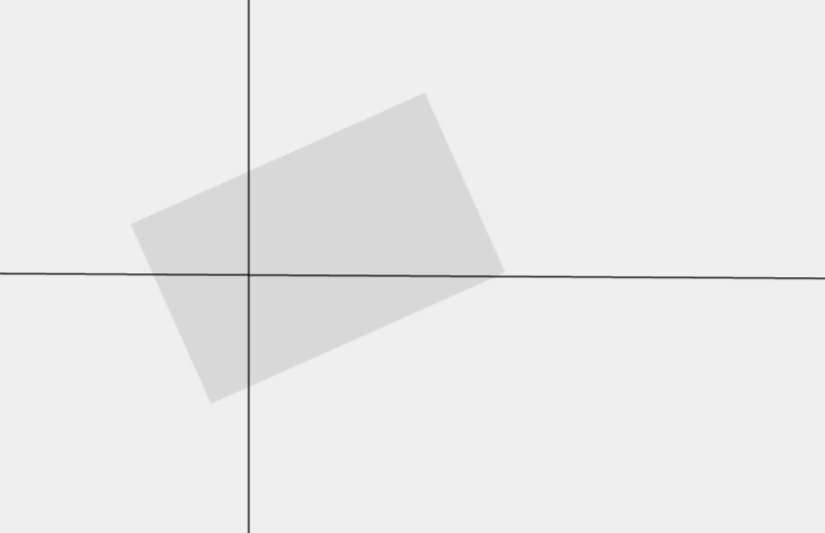
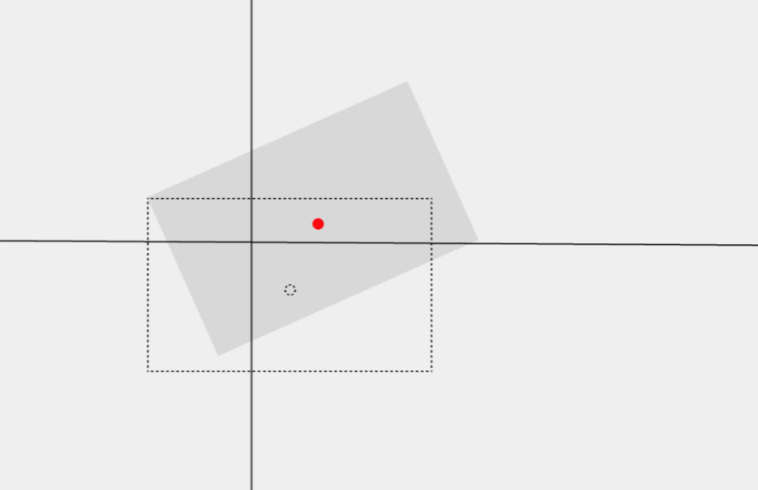
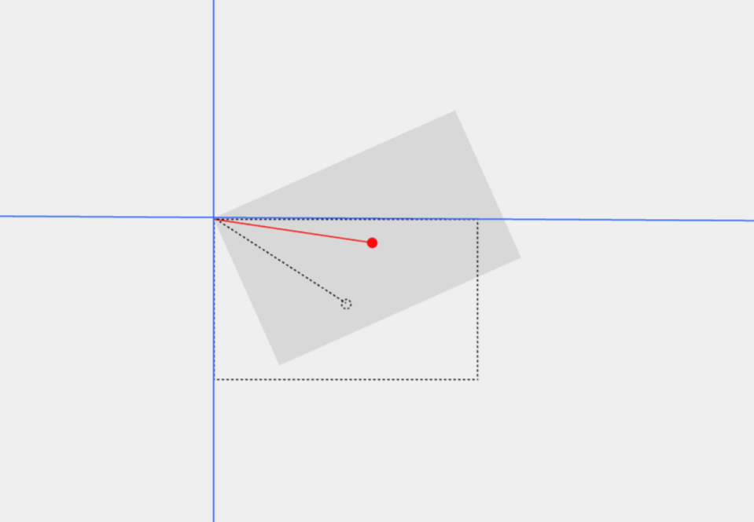
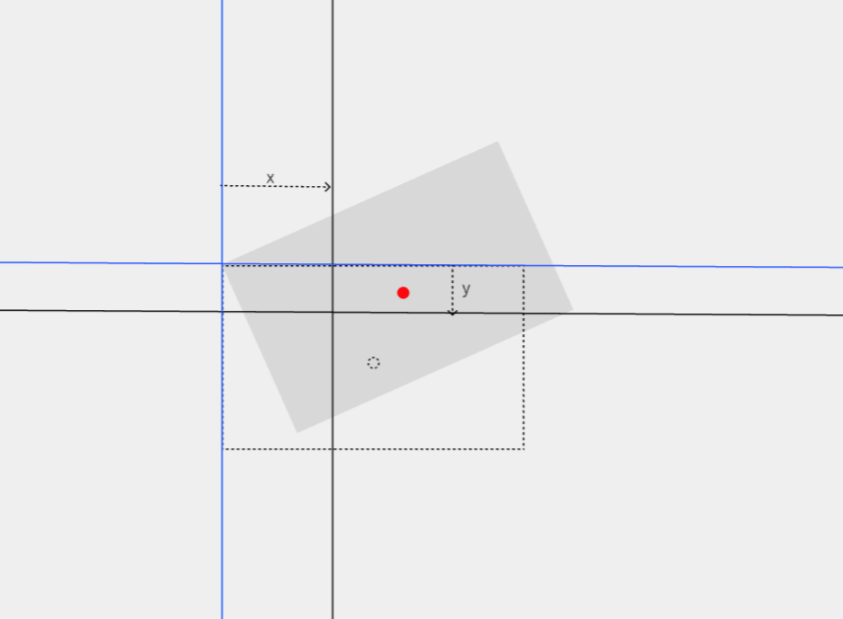

# How to Find the Center Point of a Rotated Rectangle (It's Simpler Than You Think)

So you're given this weird case:

> You know the top-left corner `(x, y)` of a **rotated** rectangle, along with its width `w`, height `h`, and rotation angle `rotation`.
> The question is: **how do you find the center of that rotated rectangle?**



At first glance, this looks like a total brain-buster.

But here's a little trick:
**Think backwards.**

---

## 🤯 Flip Your Perspective

Imagine the rectangle **before** it was rotated.
It was perfectly upright, right?

So you had a regular rectangle sitting at `(x, y)`, and then it got rotated around its **top-left corner** by some angle.



Now ask yourself:

> Where would the center of the original rectangle have _moved to_ after that rotation?

Exactly — if we can figure out where the original center ended up, that's our answer.



---

## 📐 So What's the Original Center?

If we treat `(x, y)` as the origin (0,0), then the upright rectangle’s center is just:

```
(dx, dy) = (w / 2, h / 2)
```

Now we rotate that point around the origin using basic 2D rotation formulas:

```
rotatedX = dx * cos(θ) - dy * sin(θ)
rotatedY = dx * sin(θ) + dy * cos(θ)
```

Then we shift everything back by adding `x` and `y` to those results.



---

## ✅ Final Formula

So the rotated center becomes:

```
{
  x: x + dx * cos(θ) - dy * sin(θ),
  y: y + dx * sin(θ) + dy * cos(θ)
}
```

Where `θ` is the angle in **radians**.

---

## 🧪 Full Working Code

```ts
function getRotatedRectCenter(
  x: number,
  y: number,
  w: number,
  h: number,
  angle: number // in degrees
) {
  const dx = w / 2
  const dy = h / 2
  const radian = (angle * Math.PI) / 180
  const cos = Math.cos(radian)
  const sin = Math.sin(radian)

  return {
    x: x + dx * cos - dy * sin,
    y: y + dx * sin + dy * cos,
  }
}
```

---

## 🔚 TL;DR

- The rectangle was rotated around its top-left corner.
- So rotate the center of the upright rectangle using basic 2D rotation math.
- Then just shift it back by `(x, y)`.

Clean, neat, and totally doable 🧼
