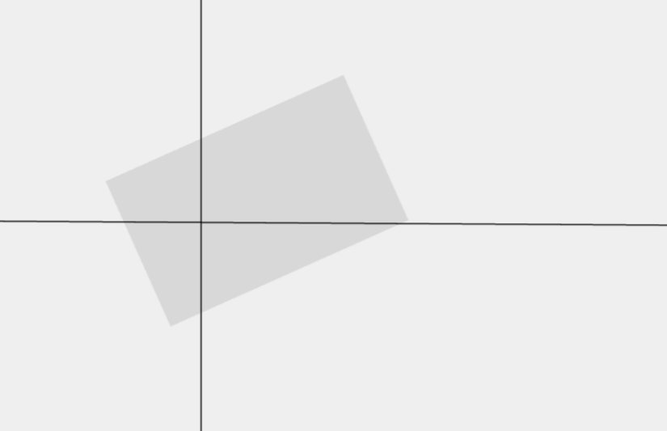

# 怎么求旋转矩形的中心点



已知矩形的旋转后的左上角 x,y, 矩形宽高 w,h, 和旋转角度 rotation, 求旋转后的矩形中心点

这个乍一看, 好像有点无从下手, 但是我们可以换个角度思考

想象一下, 你的这个矩形是从一个端正的矩形绕着左上角旋转过来的, 那么旋转后的矩形中心点不就是这个端正的矩形中心点绕着左上角旋转后的点吗?


现在我们把矩形左上角当坐标原点, 则其"原始"中心坐标`(dx, dy)`为`(w/2, h/2)`

其旋转后的中心点坐标为
`(dx * Math.cos(radian) - dy * Math.sin(radian), dx * Math.sin(radian) + dy * Math.cos(radian))`

现在我们再把坐标系偏移回来, 横偏移量就是 x, 纵偏移量就是 y


把我们计算出来的中心点坐标给同步偏移回来, 即把之前所得中心点坐标分别加上 x 和 y, 就得到了旋转后的矩形中心点

最后, 完整代码如下

```tsx
function getRotatedRectCenter(
  x: number,
  y: number,
  w: number,
  h: number,
  angle: number
) {
  const dx = w / 2
  const dy = h / 2
  // 角度转弧度
  const radian = (angle * Math.PI) / 180
  const cos = Math.cos(radian)
  const sin = Math.sin(radian)
  return {
    x: x + dx * cos - dy * sin,
    y: y + dx * sin + dy * cos,
  }
}
```
